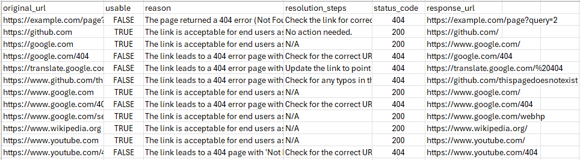

# 🤖 Link Validation & Dead Link Detection Bot 🤖

## 📘 Project Overview

This project is a personal learning initiative designed to explore AI-powered link validation — an intelligent system that automatically scans documents or web pages, checks for broken or outdated links, provides resolution step, and logs how links change over time.

It’s both a **learning exercise** and a **showcase project**, demonstrating:
    - Practical AI integration with LangChain and LLMs
    - Python CLI development and modular design
    - Best practices like logging, retry logic, and structured output
    - A foundation for potential future UI or commercial use

## ⚙️ Tech Stack

| Category | Tools Used |
|-----------|------------|
| Language | Python |
| AI/LLM | LangChain, OpenAI (Chat Models) |
| File Parsing | PyMuPDF (fitz), Regex |
| HTTP Requests | requests |
| Data Handling | csv, argparse |
| Logging | Python logging |
| (Future) UI | Streamlit / Next.js / Flask |


## 🧠 Core Features

- Read from multiple file types (e.g., .txt, .pdf)
- Extract URLs from documents
- Check link validity (HTTP status, redirects, cookies, etc.)
- AI-powered analysis — the LLM explains whether a link is usable, why not, and how to fix it
- Structured Output Parsing for reliable JSON-style responses
- Logs + CSV export for all link checks
- Retry logic using exponential backoff and clean URL normalization
- Modular design: each module (reader, HTTP client, analyzer, reporter) has a single responsibility

## 🚀 How to Run

1. Create a virtual environment
```bash
python -m venv venv
```
2. Activate it
```bash
venv\Scripts\activate      # (Windows)
source venv/bin/activate   # (Mac/Linux)
```
3. Install dependencies
```bash
pip install -r requirements.txt
```
4. Run the app
```bash
python run.py -i documents

CLI Options
usage: run.py [-h] -i INPUT
options:
  -h, --help            Show help message
  -i INPUT, --input     Directory or file path containing documents
```

## 🧩 Architecture Overview
```
link_checker/
│
├── main.py            # Orchestrates the flow
├── readers.py         # Extracts URLs from .txt / .pdf files
├── http_client.py     # Makes requests, handles retries
├── analyser.py        # Uses LangChain + LLM for AI validation
├── reporter.py        # Exports results to CSV
└── utils/             # Helper functions (normalization, logging, etc.)
```

## Example Output


## 📋 Current To-Do List

### Improvements & Next Steps

- [ ] Allow user to choose LLM (default: ChatOpenAI) & add validation
- [ ] Detect and skip potentially malicious URLs
- [ ] Enhance redirect detection and handling
- [ ] Build a small demo UI (Streamlit or Flask)
- [ ] Integrate embeddings (FAISS / Chroma) for link context
- [ ] Migrate from CSV to database (SQLite or Postgres)
- [ ] Add unit tests (normalize_url, extract_urls, detect_signals)
- [ ] Add progress bar / status indicator in CLI
- [ ] Improve performance as LLm isnt always behaving reliably (improve prompt)
- [ ] integrate more of a graph-based workflow and transform more tasks to AI use case

### Completed Work

- [x] Read .txt and .pdf files
- [x] Extract and deduplicate URLs
- [x] Validate links (status codes, redirects, cookies, etc.)
- [x] Integrate LangChain and LLM analysis
- [x] Structured LLM output via Format Instructions
- [x] Generate CSV report
- [x] Logging with logging module
- [x] Modular architecture with clear responsibilities
- [x] Add retry + exponential backoff logic
- [x] Add signals to give LLM additional context for fallback pages


## Learnings

### Nicole’s Learnings

- Prompt design, format instructions, and structured parsing with LangChain
- Use of __name__ for logger configuration per module
- Python type hints (List, Dict, Optional) and static methods
- Regex URL extraction and URL normalization with urlparse
- Understanding redirects, response attributes, and why HEAD requests are used
- Logging setup (logging.basicConfig(level=logging.INFO, format="%(levelname)s:%(message)s"))
- Clean dictionary handling (.get(), unpacking with **, defaults using or "")
- Design patterns: Single responsibility, modular structure
- Difference between tuples and lists, and when to use each
- How to write clean CLI programs with argument parsing and input validation

### Oisín’s Learnings

- Git branching, merging, and .gitignore
- Markdown basics and documentation
- Python fundamentals and creating CSV files
- Using CLI argument parsing (argparse)
- File handling and directory validation
- Basic project organization principles

## 💡 Future Vision

- AI-based semantic change detection (detect when a link’s content changes significantly)
- Option to recursively crawl a site (depth-limited)
- Plug-in system for different document sources (docs, wikis, URLs)
- Integration with monitoring dashboards or content management tools

## Example: What the AI Sees
    
Prompt given to the LLM includes:
- Response info (status, redirect chain, cookies, warning signals etc.)
- Structured format instructions

Example (simplified):
```json
Given the following response data:
URL: https://example.com
Status: 404 Not Found
Content snippet: "Sorry, this page has moved"

Decide:
- Is the link usable (True/False)?
- Why or why not?
- Suggested resolution steps.

Format your response as JSON:
{
  "usable": "...",
  "reason": "...",
  "resolution_steps": "..."
}
```

# Summary

This project demonstrates:
- How AI can augment traditional automation tasks
- Practical use of LangChain + LLMs in real-world validation tools
- A solid foundation for both technical learning and demo purposes